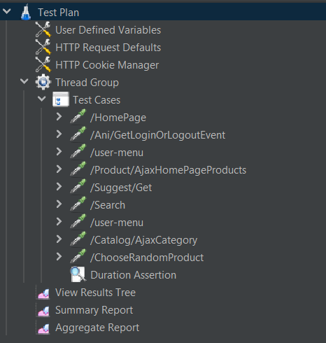
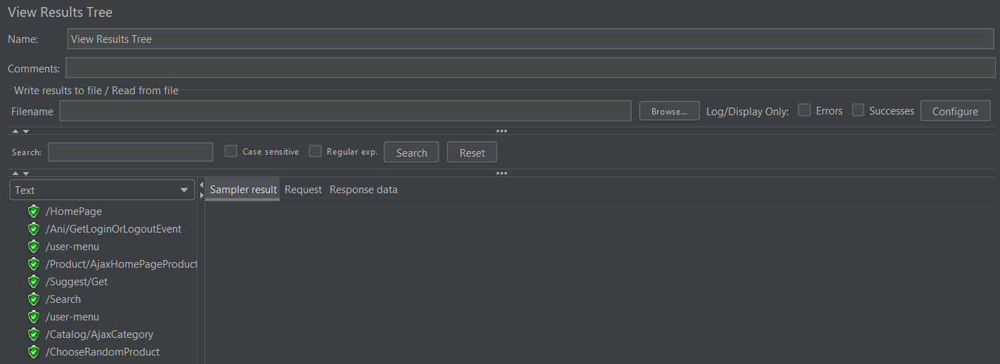
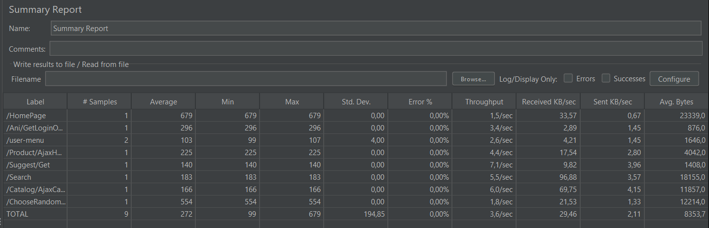
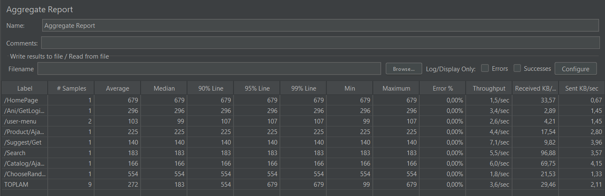

<p align="center">


</p>

This project is a load test project developed for ```https://www.cicek.com```

# Introduction

- It is a load test for the behavior of the search module and product results page under load.
- A test scenario has been written for the relevant situation.
- It will only work for 1 user.

<br>


## Technologies Used

- JMeter

<br>

## Step 1

#### Instructions

First step,we will create test cases. Then we will perform load tests for the scenarios we have created.

- [cicek.com Load Test Scenario](https://github.com/fatossgorur/ciceksepeti-patika-graduation-project/tree/main/Load%20Test)

## Step 2

In this step, we'll clone the project and open the .jmx file in JMeter

#### Instructions

- First, clone the project:

```sh
git clone https://github.com/fatossgorur/ciceksepeti-patika-graduation-project.git
```
- Open **ApacheJMeter** 

- Click on the  ```File``` > ```Open``` button located in the top left corner of JMeter

- The file you are importing is inside of the ```Load Test``` folder in this repo

- After importing you should have a test plan named ```cicekcom_load_test```

<center>
<p align="center">

</p>
</center>

<br>

# Results

<center>

#### View Results Tree
<p align="center">

</p>
  
#### Summary Report
<p align="center">

</p>
  
#### Aggregate Report
<p align="center">

</p>
</center>


